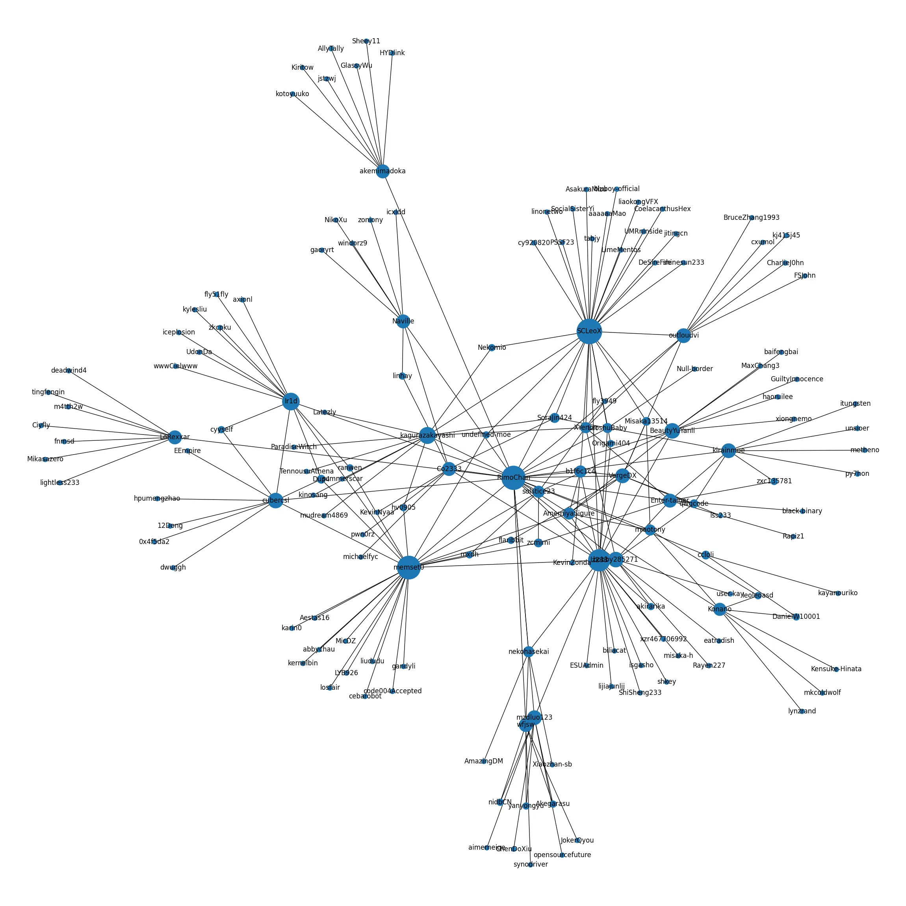

# 【steal piano】GitHub偷情分析工具！

你是否有这样的困扰，有一天你的仓库被很多人加了star，但是你却不知道这些人都是从哪来的？

别担心，**GitHub偷情分析工具**帮你轻松解决问题！


## 原理

GitHub偷情分析工具透过分析star的时间以及他们之间的follow关系，可以推测出每个star大概是被谁吸引过来的。

就是把所有仓库的star事件按时间排序，然后看看每个star的三天之内，那个人的follower有没有也来star。


## 样例

可以看到每个人直接加星的数量，以及每个人吸引来的间接加星的数量——

```text
bobby285271 直接: 2 间接: 7
BeautyYuYanli 直接: 4 间接: 7
akemimadoka 直接: 1 间接: 7
cubercsl 直接: 1 间接: 7
LoRexxar 直接: 1 间接: 7
miaotony 直接: 1 间接: 7
solstice23 直接: 5 间接: 8
outloudvi 直接: 2 间接: 8
VergeDX 直接: 6 间接: 8
Naville 直接: 1 间接: 8
LaoshuBaby 直接: 6 间接: 9
wfjsw 直接: 1 间接: 9
kagurazakayashi 直接: 1 间接: 10
Co2333 直接: 5 间接: 10
kirainmoe 直接: 3 间接: 11
Ir1d 直接: 1 间接: 11
nekohasekai 直接: 3 间接: 12
Konano 直接: 1 间接: 12
mzdluo123 直接: 4 间接: 15
Enter-tainer 直接: 2 间接: 16
ccloli 直接: 4 间接: 16
b1f6c1c4 直接: 2 间接: 22
memset0 直接: 3 间接: 37
lz233 直接: 13 间接: 48
SCLeoX 直接: 14 间接: 49
```


## 可视化




## 使用方法

首先你需要1个Python3.6以上版本，然后`pip install -r requirements.txt`。

接口是这样——

```python
def ember(token, 我, days=365, save_path='1.png'): 
    ...
```

- `token`: 你要自己去GitHub设置的Personal access tokens里注册一个，然后复制回来。(不需要加权限，用来提高GitHub访问频率的限制)

- `我`: 你的名字，比如RimoChan。

- `days`: 扫描过去多少天内的star记录。

- `save_path`: 保存可视化图片路径。


## 为什么是偷情？？？

因为找到GitHub上谁最喜欢你之后，你就可以去和她偷情了！

不说了不说了，我要去和SCLeoX偷情了，就这样，大家88。

